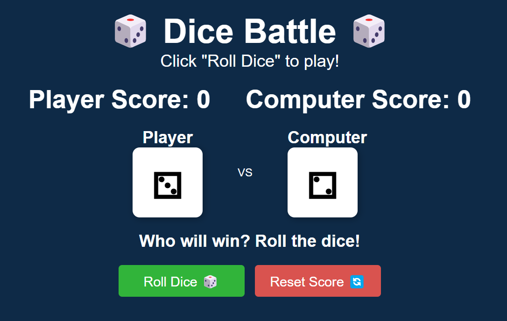
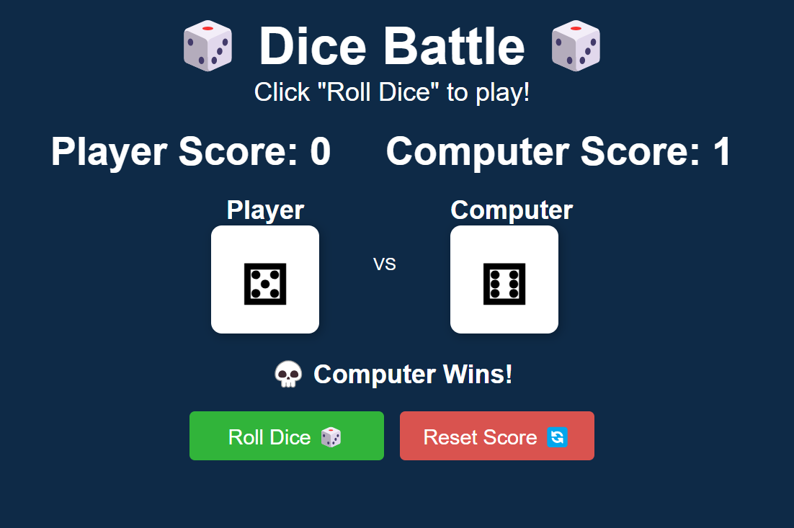
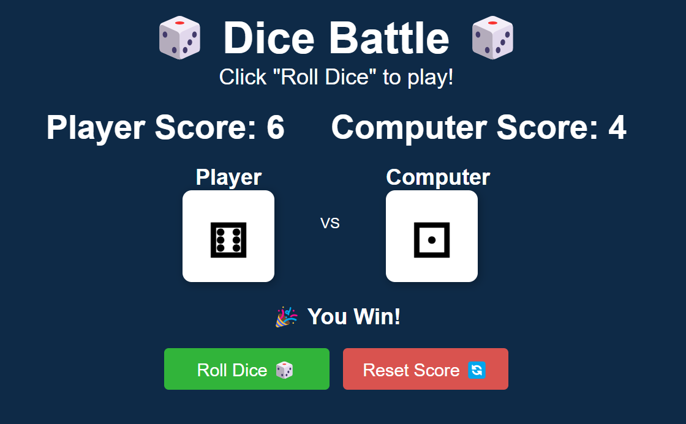

# 🎲 Dice Battle - A Fun Dice Rolling Game

## 📌 Overview
**Dice Battle** is a simple and fun dice-rolling game where you compete against the computer. Click **"Roll Dice"** to roll your dice and see if you can beat the computer! Keep track of your score and reset it anytime with the **"Reset Score"** button.

## 🚀 Features
✅ Randomized dice rolls using JavaScript  
✅ Score tracking for both Player and Computer  
✅ **Unicode dice symbols (⚀ ⚁ ⚂ ⚃ ⚄ ⚅)** instead of images for a lightweight design  
✅ **Responsive design** for mobile, tablet, and desktop  
✅ Clean and modern UI  

## 🎮 How to Play
1. Click the **"Roll Dice"** button to roll a random dice number (1-6).  
2. The computer will also roll a dice.  
3. The player with the **higher number wins** the round!  
4. Scores are updated automatically after each round.  
5. Click **"Reset Score"** to clear the scoreboard and start fresh.  

## 🛠️ Technologies Used
- **HTML5** - Structure  
- **CSS3** - Styling and responsiveness  
- **JavaScript (ES6)** - Game logic  

## 📂 Project Structure

## 📸 Screenshots
| Game Start | Dice Roll | Score Update |
|------------|----------|-------------|
| |  |  |

## 📌 Future Enhancements
- 🔹 Add sound effects when rolling dice 🎵  
- 🔹 Implement a "Best Score" leaderboard 🏆  
- 🔹 Add different dice designs 🎨  

## 📜 License
This project is open-source under the **MIT License**.
